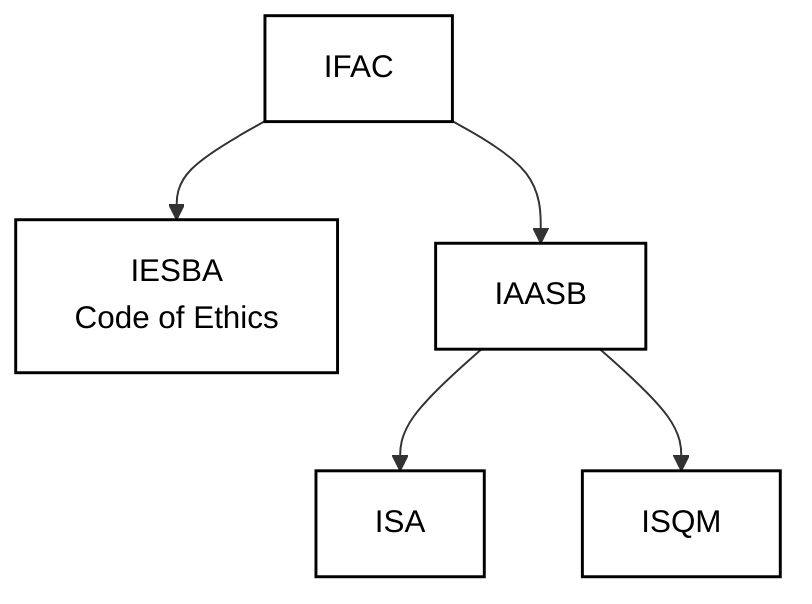
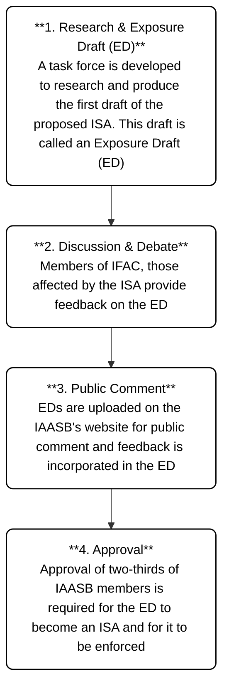

---

---
- [[#External Audit|External Audit]]
- [[#General Principles of External Audit|General Principles of External Audit]]
- [[#Key Terms|Key Terms]]
		- [[#True and Fair Presentation|True and Fair Presentation]]
		- [[#Those charged with Governance|Those charged with Governance]]
		- [[#Management|Management]]
		- [[#Engagement Partner|Engagement Partner]]
		- [[#Professional Judgement|Professional Judgement]]
		- [[#Professional Skepticism|Professional Skepticism]]
		- [[#Materiality|Materiality]]
- [[#Inherent Limitations of External Audit|Inherent Limitations of External Audit]]
- [[#Eligibility to act as an Auditor|Eligibility to act as an Auditor]]
- [[#Audit Exemption|Audit Exemption]]
- [[#Duties of External Auditor|Duties of External Auditor]]
		- [[#Accounting Records|Accounting Records]]
- [[#Rights of an External Auditor|Rights of an External Auditor]]
		- [[#During appointment as auditor|During appointment as auditor]]
		- [[#On Resignation|On Resignation]]
- [[#Responsibilities of Directors|Responsibilities of Directors]]
- [[#Appointment of Auditors|Appointment of Auditors]]
- [[#Removal of Auditors|Removal of Auditors]]
- [[#Resignation of Auditors|Resignation of Auditors]]
- [[#International Regulation|International Regulation]]
- [[#International Federation of Accountants (IFAC)|International Federation of Accountants (IFAC)]]
- [[#International Standards on Auditing (ISAs)|International Standards on Auditing (ISAs)]]
- [[#Relationship between ISAs and National Standards|Relationship between ISAs and National Standards]]
- [[#Development of ISAs|Development of ISAs]]

---
### External Audit

It is a review and assessment of the financial records to form an overall conclusion as to whether:

- The financial statements have been prepared using acceptable accounting policies, which have been consistently applied.
- The financial statements comply with all the relevant regulations and statutory requirements.
- Adequate disclosure of all material matters relevant to the proper presentation of financial information has been made.

---
### General Principles of External Audit

According to ISAs, the general principles of an audit are:

- Compliance with Code of Ethics (IFAC)
- Compliance with ISAs
- Exercise professional skepticism
- Exercise professional judgement
- Gather sufficient appropriate evidence

---
### Key Terms

##### True and Fair Presentation

Although there is no definition in the ISA of true and fair presentation, it is generally considered to be the following:

**True:** Information is factual and conforms with reality in that there are no factual errors. In addition, it is assumed that to be true it must comply with accounting standards and any relevant legislation. Lastly true includes data being correctly transferred from accounting records to the financial statements.

**Fair:** Information is clear, unbiased and not misleading and reflects plainly the commercial substance of the transactions of the entity, not just their legal form.

---
##### Those charged with Governance

The person(s) with responsibility for overseeing the strategic direction of the entity and obligations related to the accountability of the entity. This includes overseeing the financial reporting process.

---
##### Management

The person(s) with executive responsibility for the conduct of the entity’s operations.

*In some cases, all of those charged with governance are involved in managing the entity, for example, a small business where a single owner manages the entity and no one else has a governance role*

---
##### Engagement Partner

The partner in the firm who is responsible for the audit engagement and its performance, and for the auditor’s report that is issued on behalf of the firm, and who has the appropriate authority from a professional, legal or regulatory body.

---
##### Professional Judgement

Professional judgement is the application of relevant training, knowledge, and experience to make informed decisions appropriate to the circumstances of the audit engagement.  
Professional judgement is essential to the proper conduct of an audit.

Professional Judgement is used when:  
**Applying Standards:** Interpreting and applying ethical requirements and ISAs.  
**Risk Assessment:** Identifying and assessing risks of material misstatement.  
**Audit Planning:** Determining the nature, timing, and extent of audit procedures.  
**Audit Evidence:** Evaluating whether sufficient appropriate audit evidence has been obtained.  
**Forming Conclusions**: Assessing evidence, resolving conflicting information, and evaluating the reasonableness of management's estimates.

Professional judgement is used throughout the audit:  
**Plan → Assess Risks → Gather Evidence → Evaluate Evidence → Conclude**

---
##### Professional Skepticism

Professional skepticism is an **attitude that includes a questioning mind**, being alert to conditions that may indicate possible misstatement, and critically assessing audit evidence.  
The auditor must perform the audit with professional skepticism, recognizing that conditions may exist that could cause **material misstatement** in the financial statements.

The auditor is alert to:

- Conditions indicating possible fraud or error.
- Contradictory audit evidence.
- Information that questions the reliability of documents or written representations.
- Circumstances requiring additional audit procedures beyond ISA requirements.

**Important Assumption Rule**

- Documents may be accepted as genuine unless there is reason to doubt them.
- The auditor should assume **neither dishonesty nor unquestioned honesty** of management.

**Maintaining professional skepticism** reduces risks of:

- Overlooking unusual or suspicious circumstances.
- Overgeneralizing from limited audit evidence.
- Using inappropriate assumptions when planning or evaluating audit procedures.

**Skepticism = Question everything, but prove nothing without evidence.**

---

| Professional Judgement              | Professional Scepticism                |
| ----------------------------------- | -------------------------------------- |
| Deciding what to do                 | Questioning what is presented          |
| Uses experience and knowledge       | Uses critical mindset                  |
| Applied in planning and conclusions | Applied throughout evidence evaluation |

The auditor neither assumes that management is dishonest nor assumes that everything is correct. Claims and assertions must be supported by evidence.

---
##### Materiality

Information is material if its omission or misstatement could influence the economic decisions of users taken on the basis of the financial statements. The auditor must be concerned with identifying 'material' errors, omissions and misstatements. Both the amount (quantity) and nature (quality) of misstatements need to be considered. To put this into practice the auditor therefore has to set his own materiality levels – this will always be a matter of judgement.

---
### Inherent Limitations of External Audit

1. Sampling – it is not practical for an auditor to test 100% of transactions and so they apply sampling methodologies in selecting balances/transactions to test. Therefore, there could be an error in an item not selected for testing by the auditor.
2. Subjectivity – financial statements include judgmental and subjective areas and therefore the auditor is required to use their judgment in assessing whether the financial statements are true and fair.
3. Inherent limitations of internal control systems – an internal control system is operated by people and hence is susceptible to human error. In addition, there is the possibility of controls override by management and of collusion and fraud. 
4. Evidence is persuasive not conclusive – the opinion is based on audit evidence gathered; however, while this evidence can indicate possible issues affecting the audit opinion, evidence involves estimates and judgments and hence does not give a definite conclusion.
5. Incomplete Information - Even if everything reported on was examined and found to be satisfactory, information provided by the client may be incomplete or may have falsified transactions.
6. Materiality - Auditors plan their work to detect material errors and frauds only, so small frauds (or large frauds split into many small amounts) may go unnoticed.

---
### Eligibility to act as an Auditor

To be eligible to act as an auditor, a person must:

- pass an approved set of examinations set by a Recognized Qualifying Body (RQB), examples are ACCA or ICAEW
- be a member of a Recognized Supervisory Body (RSB), examples are ACCA or ICAEW
- be someone directly authorized by the State
- not be a director or employee of the company, or of any associated companies

---
### Audit Exemption

It is a statutory requirement in nearly all jurisdictions that companies be audited. However, some jurisdictions recognize that for some "small" companies the benefit of having an audit is relatively limited and may not justify the costs involved.
Note that these exemptions often do not apply to companies in certain regulated sectors such as financial services companies or companies listed on stock exchange.
Reasons for exempting small companies from audit are as follows:

- The owners and managers of the company are often the same people.
- Few sources of income.
- Simple management structures and accounting functions.
- The advice and value which accountants can add to a small company is more likely to concern other services such as accounting and tax.
- The impact of misstatements in the financial statements of small companies is unlikely to be material to the wider economy.
- The audit fee and disruption of an audit are seen as too great a cost for any benefits the audit might bring.

---
### Duties of External Auditor

- **Maintenance of Adequate Accounting Records:** The auditor while performing his duties must check whether proper and adequate accounting records have been maintained and prepared.
- **Compliance with Legislation:** It is the duty of an auditor to ensure that all the applicable regulations have been complied with while preparing the financial statements.
- **Verification of Records:** The auditor’s duty is to examine, compare and verify the accounting records and returns with the financial statements. If the accounting records do not agree with the financial statements or are incomplete, then it is the duty of the auditor to report this fact to the shareholders.
- **Truth and Fairness:** It is the primary duty of the auditor to prepare a report on the financial statements examined by him and state whether, in his opinion and to the best of his knowledge, the financial statements provide:
	- a true and fair state of affairs at the end of the accounting period, in the case of statement of financial position (SOFP)
	- a true and fair view of the amount of profit or loss during the accounting period, in the case of statement of comprehensive income (SOCI)
- **Adequate Disclosures:** Another duty of an auditor is to ensure that the financial statements and all the other material disclosures are made in accordance with the applicable statute. The auditor also needs to verify whether all the payments and benefits accruing to directors from the company are properly disclosed in the accounts.

##### Accounting Records

- the records of initial accounting entries and supporting records (e.g. records of electronic fund transfers, invoices, contracts)
- the general ledger, journal entries and other adjustments to the financial statements that are not recorded in formal journal entries
- records such as worksheets and spreadsheets supporting cost allocations, computations, reconciliations and disclosures

---
### Rights of an External Auditor

The regulatory framework, within which the auditors are required to perform, provides them with certain rights to perform their duties effectively:

##### During appointment as auditor

- A right to have access to the books, accounts and vouchers of the company at all times.
- A right to require from company officers any information and explanations considered necessary for the audit. In case of the auditors of a holding company, a right to request information and explanations from subsidiaries of the holding company and their auditors.
- A right to have unrestricted access to persons within the entity from whom the auditor determines it necessary to obtain audit evidence.
- A right to receive notice of and attend any general meeting of members of the company.
- A right to be heard at any general meeting on matters of concern to the auditor.
- A right to make written representations when the company proposes to appoint auditors other than them.

##### On Resignation

- A right to request a general meeting of the company to explain the circumstances of the resignation.
- A right to require the company to circulate the notice of circumstances relating to the resignation.

---
### Responsibilities of Directors

- Directors are expected to safeguard the assets of the company.
- The company is expected to keep accounting records sufficient to enable the directors to ensure that the balance sheet and profit and loss account prepared under the Companies Act comply with the Act. In practice, the directors will, in all but the smallest companies, delegate much accounting work to employees of the company.
- Directors are responsible for preventing errors, irregularities and fraud. This task should be addressed by setting up appropriate controls within the company.
- The directors must prepare financial statements for each financial year of the company. The annual accounts are required to show a true and fair view of the state of affairs of the company at the balance sheet date and of its profit or loss for the accounting period then ended, and to be properly prepared in accordance with the Companies Act 1985.
- The directors are required to lay a copy of the annual accounts before the members in general meeting. Under provisions introduced by the Companies Act 1989, a private company may exempt itself from this requirement.
- The directors must file a copy of the accounts with the Registrar of Companies within seven months of the end of the accounting period in the case of public companies.

---
### Appointment of Auditors

**Members (Shareholders) -** of the company appoint the auditor by voting them in at the annual general meeting (AGM).
**Directors -** can appoint the first auditor of a newly-formed company or to fill a "casual vacancy" (where the current auditor is no longer able to act). This requires the shareholders' approval at AGM. In some countries the auditor may be appointed by the directors as a matter of course.
**Secretary of State -** if no auditor is appointed by shareholders or directors, company law may allow for an appropriate government department to make the appointment.

Auditors of public companies are appointed from one AGM to the next one.
Auditors of private companies are appointed until they are removed.

---
### Removal of Auditors

- Directors cannot remove the auditors themselves.
- Auditors can be removed by a simple majority at a general meeting.
- The auditors should be given notice of such a meeting.
- They are allowed to speak at the general meeting.
- The auditor must submit a written statement to the company's registered office explaining the reasons for their removal or resignation (or stating that there are no such reasons). They may also request an Extraordinary General Meeting (EGM) to explain these reasons directly to the shareholders.

---
### Resignation of Auditors

If an auditor resigns, they should do so in writing and they may wish to speak to the shareholders to explain their reasons. The procedures for the resignation of the current auditors will normally include the following:

- The resignation should be made to the company in writing. The company should submit this resignation letter to the appropriate regulatory authority. 
- The auditor should prepare a Statement of the Circumstances. This sets out the circumstances leading to the resignation, if the auditor believes that these are relevant to the shareholders or creditors of the company. If no such circumstances exist, the auditor should make a statement to this effect. This statement should be sent:
	- By the auditor to the regulatory authority
	- By the company to all persons entitled to receive a copy of the company's financial statements (principally the shareholders)

---
### International Regulation

where, 

- IFAC -> International Federation of Accountants
- IESBA -> International Ethics Standards Board for Accountants
- IAASB -> International Auditing and Assurance Standards Board
- ISA -> International Standards on Auditing
- ISQM -> International Standards on Quality Management

---
### International Federation of Accountants (IFAC)

The International Federation of Accountants (IFAC) is the global organization for the accountancy profession.
IFAC promotes international regulation of the accountancy profession. By ensuring minimum requirements for accountancy qualifications, post qualification experience and guidance on accounting and assurance for accountants around the world, there will be greater public confidence in the profession as a whole. 

---
### International Standards on Auditing (ISAs)

ISAs are issued by the International Auditing and Assurance Standards Board (IAASB) and provide guidance on the performance of an audit. There are currently 37 IASs and 2 ISQM (International Standards on Quality and Management)

- ISAs provide guidance on how to plan and conduct the audit to ensure that audit is conducted consistently, and quality is maintained.
- ISAs only apply to the audit of historical financial information. They are written in the context of an audit of financial statements by an independent auditor.
- The basic principles and essential procedures of an ISA are to be applied in all cases. If in exceptional cases the auditor deems it necessary to depart from an ISA to achieve the overall aim of the audit, then this departure must be justified.
- ISAs are not laws and where local laws contradict with ISAs, local laws should be followed.
- ISAs must be applied in all but exceptional cases. Where the auditor deems it necessary to depart from an ISA to achieve the overall aim of the audit, this departure must be justified.

---
### Relationship between ISAs and National Standards

IFAC is simply a grouping of accountancy bodies, therefore it has no legal standing in individual countries. Countries therefore need to have their own arrangements in place for:

- Regulating the audit profession
- Implementing audit standards

National standard setters:

- may develop their own auditing standards and ethical standards
- may adopt and implement ISAs, possibly after modifying them to suit national needs.

The IAASB has managed to:

- Cooperate with national standard setters
- Help minimize duplication of efforts
- Gain support and acceptance of their standards during the early stages of their development

In addition, the IAASB also hosts an annual meeting with various national auditing standard setters to discuss and debate proposed ISAs and drafts. In this way the board can reach a consensus with local standard setters at an early stage of development for the ISAs.

In the event of a conflict between the two sets of guidance, local regulations will apply.

---
### Development of ISAs

---
