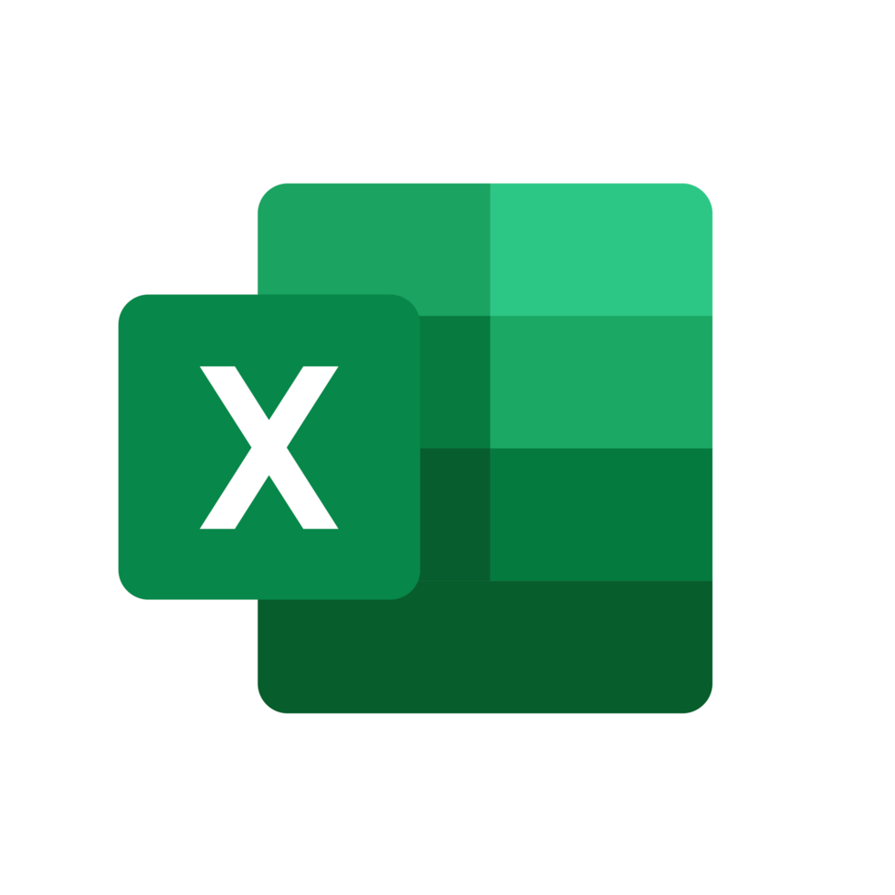

*A living record of my progress, skills, and studies.*

I've always been curious about how money works — not just personally, but on a professional level. How do companies operate? How do banks function? What's really going on behind the numbers, taxation and stuff?

ACCA felt like the right path to answer those questions properly. Two years in, it's challenging — but that's kind of the point. The difficulty is what makes it worth it.

The plan? Land a solid job first, build real experience, and eventually use everything I've learned to run something of my own.

---

  

    ACCA Journey
    7 of 17 exams
  

  
41%

  

    

      

    

    

      

        

      

    

    

      

    

  

  

    

      
Foundation

      
✅ Completed

    

    

      
Skills

      
🔄 In Progress

    

    

      
Professional

      
⏳ Upcoming

    

  

---
## Current Exam

### FR — Financial Reporting
*Skills Level · Deadline: June 2026*

Financial Reporting is my first Skills level exam. It's a significant step up from Foundation level, covering IFRS standards, consolidated financial statements, and interpretation of accounts. Just getting started, but fully committed.

**What FR covers:**
- Preparation of financial statements under IFRS
- Consolidated financial statements
- Interpretation and analysis of financial statements
- Current issues in financial reporting

---
## Study Resources

These are the materials I use to study:

- **ACCA Study Hub** — Official ACCA learning platform
- **Kaplan** — Study Text and Exam Kit
- **BPP** — Exam Kit
- **SKANS Notes** — Local study notes

---
## Tools

  

    
    

      
Obsidian

      
Note taking

    

  

  

    
    

      
Microsoft Excel

      
Numerical questions

    

  

  

    
    

      
Anki

      
Flashcards & review

    

  

## Certificates

<iframe src="/carousel.html" width="100%" height="500px" style="border: none; border-radius: 20px;"></iframe>
